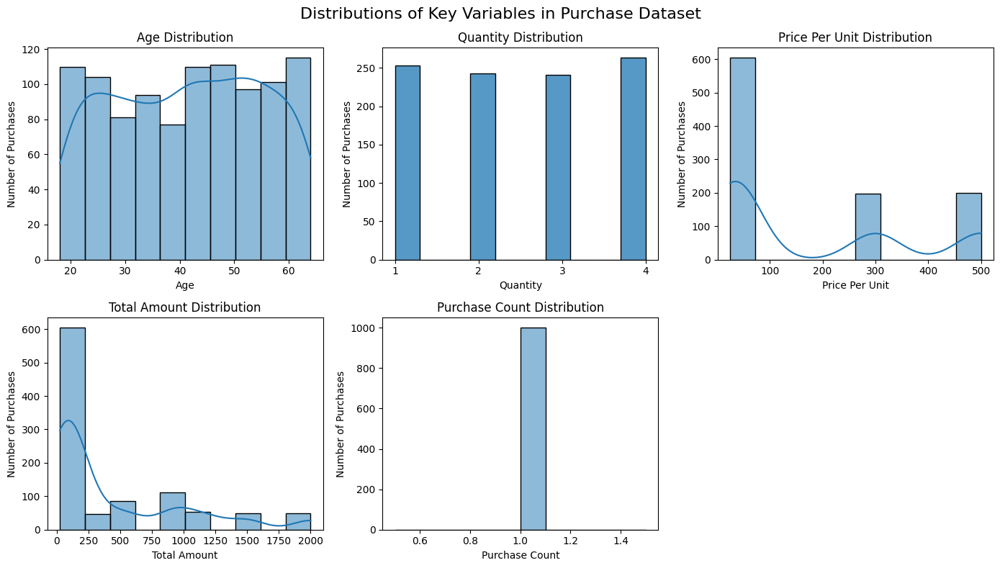
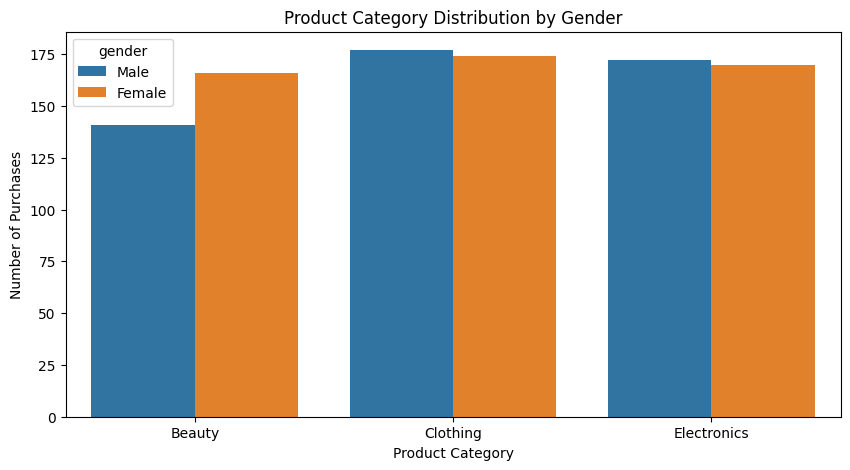
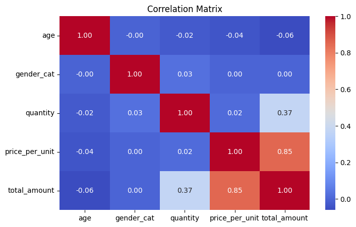
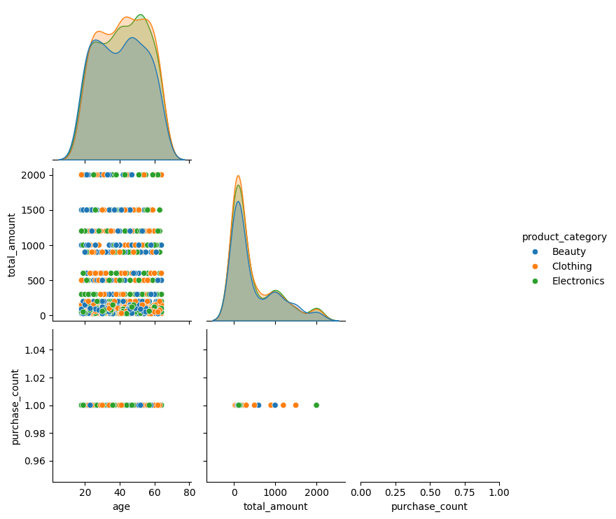
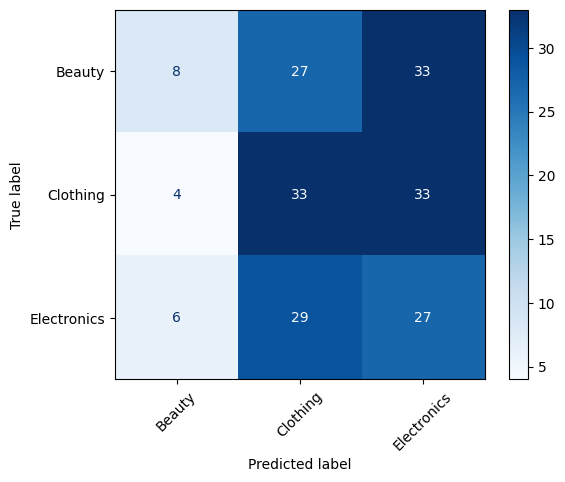
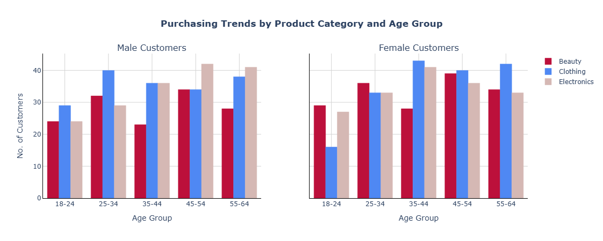
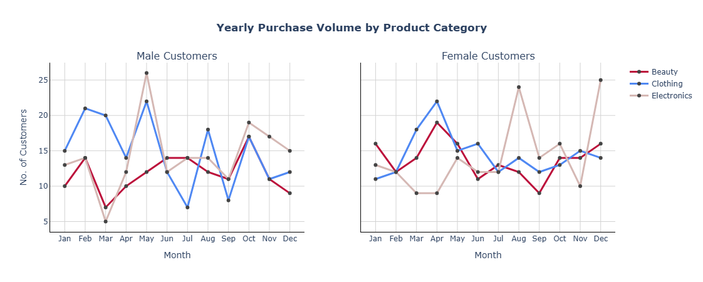

# Retail Sales Behavior Prediction  
**Data Science Institute – Cohort 8 – Group 6**

---

# Team Members
- Aram Dezfuli  
- Junaid Ghani  
- Nicole Latendresse  
- Mary Randle  
- Pavi Chandrasegaram  

---

# Project Overview

This project analyzes customer retail transaction data to explore whether customer demographics and purchasing behavior can be used to predict the **product category** a customer is most likely to purchase.

Using a retail dataset containing demographic information and transaction details, we applied exploratory analysis, visualization techniques, and machine learning classification models to evaluate whether meaningful predictive patterns exist.

The goal is to better understand customer purchasing behavior and assess whether such insights could support **targeted marketing strategies, product recommendations, and customer segmentation** in a retail environment.

---

# Business Objective

Retailers frequently seek to understand how customer characteristics influence purchasing decisions. If businesses can anticipate what type of products customers are most likely to buy, they can improve marketing campaigns, optimize product recommendations, and enhance personalized shopping experiences.

The primary business question addressed in this project is:

**Can we predict the product category a customer is likely to purchase based on demographic attributes and transaction-related features?**

Although the dataset is simplified, the project demonstrates how data science methods can be used to investigate customer purchasing patterns.

---

# Stakeholders

Potential stakeholders for this analysis include:

- Marketing teams seeking to improve targeted campaigns  
- Product managers responsible for category performance  
- Customer analytics teams studying purchasing behavior  
- Retail strategists looking to improve personalization  

Insights from this analysis could help stakeholders better understand how customer characteristics relate to purchasing patterns.

---

# Dataset

The dataset used in this project is the **Retail Sales Dataset** available on Kaggle.

**Source:**  https://www.kaggle.com/datasets/mohammadtalib786/retail-sales-dataset

### Dataset Characteristics
- Contains **1000 retail transactions** each representing a unique customer
- Includes purchase across three main product categories:
  - Beauty
  - Clothing
  - Electronics

### Key Features
- **Customer ID:** Unique identifier for each customer
- **Age:** Age of the customer
- **Gender:** Customer's gender
- **Product Category:** Type of product purchased
- **Quantity:** Number of units purchased
- **Price per Unit:** Cost of a single unit
- **Total Amount:** Final amount calculated per transaction

### Dataset Limitations

Several characteristics of the dataset limit its real-world generalizability: 

- Each customer appears only once, providing no repeat purchase history or longitudinal behaviour 
- Only three broad product categories are included restricting diversity in purchasing patterns
- The dataset contains no missing values or failed transactions, which is uncommon in real operational data
- Age range is narrow (18–64) reducing demographic breadth
- Pricing structure appears simplified

Together, these constraints reduce the depth behavioral signals available for modeling and may impact predictive performance.

---

# Techniques and Technologies

The project was implemented using the following tools and libraries:

## Programming Language
- Python

### Libraries
- **Pandas** – data manipulation and preprocessing  
- **NumPy** – numerical operations  
- **Matplotlib** – basic data visualization  
- **Seaborn** – statistical visualization  
- **Plotly** – interactive and accessible visualizations  
- **Scikit-Learn** – machine learning models and evaluation  

### Development Environment
- Jupyter Notebook
- Git and GitHub for version control and collaboration

---

# Methodology

# Data Cleaning 

The dataset was first examined for missing values, and no missing data were detected. Several preprocessing steps were completed to prepare the data for modeling, which includes:
    - identify any missing values 
    - creating new columns for month, day and year from the date fields
    - constructing age groups and corresponding categorical labels to better segment customer demographics 

# Exploratory Data Analysis

Exploratory data analysis was conducted to understand the distribution of demographic and transactional variables and to identify potential predictive relationships. The dataset consists of 1,000 retail transactions with demographic, product, and purchase information, to conduct an exploratory data analysis.

### Key Observations

- **Age distribution** across product categories shows broadly similar patterns, with moderate differences in central tendency and spread. Overall, age contributes contextual information that may improve classification performance when combined with other demographic and transactional features.
- **Purchase quantity** is typically small, with most customers buying three or fewer items.
- **Price per unit** shows that most purchases are low-value items, with a smaller number of higher-priced transactions.
- **Total transaction amount** is strongly right-skewed, indicating a small number of high-value purchases.
These distributional patterns suggest that behavioral variables carry stronger predictive signal than demographics.

- **Gender differences** appear primarily in Beauty purchases, which show a female skew.

Despite some observable patterns, product categories show significant overlap across demographic and transactional variables.

This suggests that predicting product category will require combining multiple features rather than relying on a single strong predictor.

Overall, Gender improves prediction for only one category but cannot independently determine product choice. Therefore, gender shall be treated as a complementary predictor to enhance model performance when combined with behavioral features such as spending and quantity purchased.

- **Correlation Matrix** highlights the relationships among key numerical predictors and provides insight into potential redundancy and multicollinearity.

Overall, most variables exhibit low to moderate correlation, with one exception.

- **Pair Plot** provides insight into how well these variables separate product categories and whether natural clustering exists.

Single predictors are insufficient on their own, reinforcing the need for multivariate models rather than rule-based classification.

### Conclusion
Based on the exploratory data analysis, it is possible to predict the product category a customer is likely to purchase based on their age, gender, and previous purchase history but with significant limitations.  

The prediction accuracy will be constrained by: 
> Absence of repeated purchase history  
> Limited behavioral depth at the customer level  
> Overlapping feature distribution across categories.  

Considering all of the above, the variables can inform a model to estimate the likelihood of a customer purchasing a specific product category, but predictions should be interpreted probabilistically rather than as absolute outcomes.  

For future, richer behavioral data or increased repeat customers to improve purchase history can significantly enhance predictive performance. 

---

# Classification Modeling

To predict product category, we implemented a **supervised classification approach** using logistic regression.

### Model Inputs
The model used the following predictors:
    - Age  
    - Gender  
    - Transaction-related features (such as purchase date)

### Modeling Approach

Two classification models were developed and evaluated:
    - Logistic Regression (linear model)
    - Random Forest Classifier (non-linear model)

Both models were assed using cross-validations, comparing key performance metrics, which included: F1-score, accuracy, precision, recall. 

### Model Performance

The classification model used age, gender, and purchase history to predict the product category a customer was likely to purchase. 

Using logistic regression, the model achieved and overall accuracy of approximately **37%**, representing the percentage of all predictors that accurately predicted, and F1 score of about 0.35, which reflects the balance between precision and recall.  These results indicate relatively week predive performance. 

With three product categories, random guessing would yield an expected accuracy of approximately 33% meaning the model performed only marginally better than chance. The confusion matrix further shows the consistent misclassification patterns: predictions were disproportionately assigned to Clothing or Electronics, which frequent confusion between these two categories. Beauty purchases were often misclassified into one of the other two categories. 

# Early Trends Identified  

Data visualization played an important role in both **exploring patterns** and **communicating insights** from the dataset.

Visualizations were created using **Matplotlib, Seaborn, and Plotly**, with attention to readability and accessibility, including color-blind-friendly palettes.

One key visualization is a **grouped bar chart** illustrating the distribution of product category purchases across five age groups: 18–24, 25–34, 35–44, 45–54 and 55–64.   

- Customers aged **45–54** show the highest overall purchasing activity.
- The **18–24** age group has the lowest purchase counts, particularly females purchasing clothing 
- **Clothing purchases remain relatively consistent** across most age groups.
- **Electronics purchases increase among middle-age customers**.
- **Male customers** tend to buy more electronics as they age while **female customers** tend to buy more clothing 

A look at customer behaviour by month, shows some interesting findings, as well

- **Clothing:** Both male and females some seasonal purchasing patterns, but females customers peaks are borader and more consistent, while male cusomters have sharper peaks and more pronouced mid-year dips 
- **Beauty:** Mainly consistent for both, but slightly higher rise in teh fall months.  
- **Electronics:** The month-to-month volatity suggest event-driven purchasing.  Both Males and Female cusotmers show large surges (males: May and October; females: August, December) 
- **Overall**, males purchases in the year are bit more volitaile then  then females trends are bit more consistent espeically fo rbeauty and clothing. 

Although these visualizations highlight demographic patterns, the distributions still overlap significantly across product categories.

---

# Key Findings

Several insights emerged from the analysis:

- Demographic variables such as **age and gender provide limited predictive power**.
- Transaction-level variables show **some signal but still overlap heavily across categories**.
- The absence of repeat purchase history significantly reduces behavioral insight.
- Product categories in the dataset are not clearly separable using the available features.

These findings suggest that **the available variables are insufficient for strong predictive modeling**.

---

# Recommendations

For improved predictive performance in real-world applications, future analyses should consider:

- Incorporating **repeat purchase behavior** to capture customer habits and retention patterns.
- Expanding the number of **product categories** to add more model granularity and reduce bias 
- Including **customer online browsing behavior** like page views, dwell time, cart interactions, which can meaningfully enhance predictive signals
- Integrating **customer loyalty or engagement metrics**, including reward status, email engagement, and promotional responsiveness can help differentiate between casual and high value customers 

Overall, incorporating richer behavioral data would significantly improve the ability to model customer purchasing patterns.

---

# Conclusion

This project explored whether customer demographics and transaction data could predict product category purchases.

The classification model achieved modest predictive performance, only slightly exceeding random guessing or naive baseline model prediction. This outcome reflects the limited predictive information available in the dataset, particularly the absence of repeat customer behavior and the restricted number of product categories.

Despite these limitations, the project demonstrates the application of a full data science workflow, including exploratory analysis, visualization, feature preparation, and classification modeling.

Future work using larger and more behaviorally rich datasets could significantly improve predictive performance and provide stronger insights for retail decision-making.

---

## Individual Presentation Videos

| Name | Link |
|-----|-----|
| Aram Dezfuli | https://www.loom.com/share/6a04d7ace21f4bb490d66e5233472aa3 |
| Junaid Ghani | https://youtu.be/l3G2twMO_T8 |
| Nicole Latendresse | https://www.loom.com/share/8c183674ec5846458100d308bc3607ba |
| Mary Randle  | https://youtu.be/yyoIqQcskZo |
| Pavi Chandrasegaram  | https://www.youtube.com/watch?v=yeGJQYe85bE |

---

## Project Task Breakdown & Roles

### 1. README  (Midpoint Submission)
- Lead – Aram
- Mary – Review
- Tasks:
    - Contents 1-2-3 - Pavi, Mary, Nicole
    - Other Contents - Aram
    - Compile - Aram
    - Review - Mary

### 2. Data Cleanup & Preparation
- Lead: Mary
- Reviewer: Nicole
- Tasks:
    - Data validation
    - Feature formatting
    - Outlier check
    - Data consistency verification

### 3. Exploratory Data Analysis (EDA)
- Lead: Junaid
- Reviewer: Pavi
- Tasks:
    - Visual exploration
    - Distribution analysis
    - Correlation analysis
    - Outlier detection

### 4. Feature Engineering & Processing
- Lead: Nicole – Lead
- Reviewer: Mary
- Support: Aram
- Tasks:
    - Encoding categorical variables
    - Scaling if required
    - Train/test split preparation

### 5. Classification Modeling
- Lead: Nicole
- Reviewer: Aram, Junaid
- Models:
    - Logistic Regression
    - Random Forest

### 6. Training & Cross-Validation Implementation
- Lead: Nicole
- Reviewer: Aram, Pavi 
- Tasks
    - k-fold cross-validation
    - Model comparison
    - Performance metrics evaluation

### 7. Visualization & Styling
- Lead: Pavi
- Support: Junaid
- Reviewer: Junaid
- Tasks:
    - Plot styling
    - Clean presentation charts
    - Model comparison visuals

### 8. Reproducibility & Repository Cleanup
- Lead: Aram (-> Junaid)
- Reviewer: Junaid (-> Aram)
- Tasks: 
    - Folder structure cleanup
    - Removing duplicate plots
    - Ensuring clear README instructions
    - Requirements.txt validation

### 9. Final Submission - README file 
- Lead: Aram
- Reviewer: Mary
- Tasks: 
  - Review course slides and provided examples
  - Confirm submission expectations with instructor and Learning Support (LS)
  - Draft and structure final README content
  - Incorporate feedback
  - Final formatting and repository cleanup

### 10. Final Live Presentation 
- Lead: Mary
- Supports: Junaid, Aram

### 11. Final Code Check and README update
- Lead: Aram
- Support: Mary

### 12. Post Review Issue Resolutions
- Lead: Aram
- Support: Team

---

## Setup Instructions (Optional)

1. Clone the repository
   git clone https://github.com/your-repo/D6_Retail-Sales-Dataset.git

2. Navigate to the project folder
   cd D6_Retail-Sales-Dataset

3. (Optional) Remove old environment folders
    If you have a previous virtual environment (e.g., lcr-env or visualization-env), you can delete its folder manually to avoid conflicts.

4. Create a new virtual environment
    python -m venv ds6-env

5. Activate the environment
    On Windows (PowerShell):
        .\ds6-env\Scripts\activate
    On macOS/Linux:
        source ds6-env/bin/activate

6. Install dependencies
   pip install -r requirements.txt

7. Register the environment as a Jupyter kernel
    python -m ipykernel install --user --name=ds6-env --display-name "DS6 project"

8. Open the Jupyter notebooks in the `Jupyter Notebooks/` folder, select the DS6 project kernel, and run the notebooks.

    
